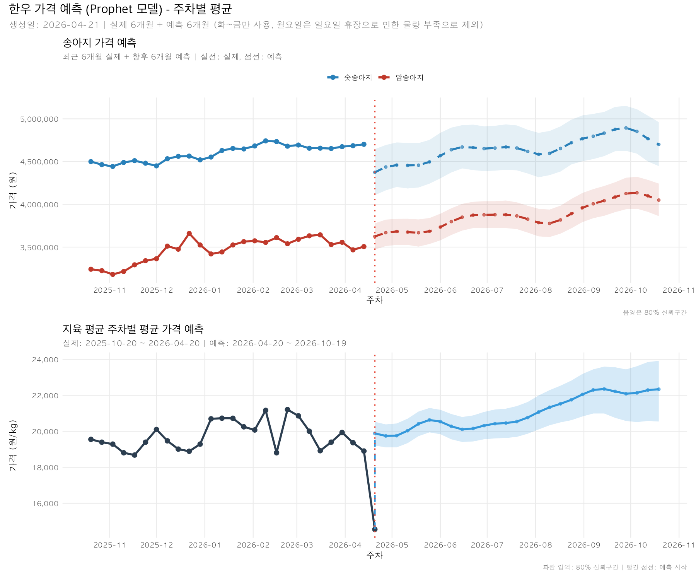
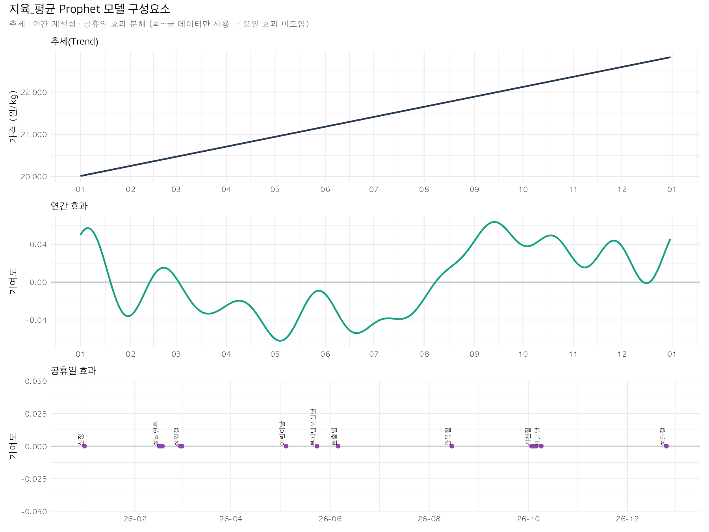

# EKAPE Parsing - 한우 가격 데이터 자동 수집 및 예측

[축산물품질평가원(EKAPE)](https://www.ekapepia.com/)의 한우 가격 데이터를 자동으로 수집하고, **Prophet 모델**로 예측값을 생성하는 저장소입니다.

## 📈 가격 예측 그래프

> 최근 6개월 실제 가격과 향후 6개월 예측값을 **주차별 평균** 기준으로 시각화했습니다. 파란 영역은 80% 신뢰구간입니다.



## 🧩 모델 구성요소 그래프

> 대표적으로 `지육_평균` 모델을 기준으로, Prophet이 학습한 추세, 연간 계절성, 공휴일 효과를 분해해 보여줍니다.



## 📏 모델 성능

> 2018년 이후 데이터를 기준으로, 6개월 horizon Prophet 교차검증으로 측정한 최신 성능입니다.

| 변수 | MAPE | RMSE | MAE |
|------|------|------|-----|
| 암송아지 | 11.35% | 383,554원 | 308,554원 |
| 숫송아지 | 7.39% | 349,308원 | 277,812원 |
| 지육_평균 | 6.88% | 1,445원/kg | 1,225원/kg |

> 숫송아지 예측은 초기 대비 약 27.7%, 지육 평균은 약 9.2% 상대 개선되었습니다.

## 📅 자동 실행

- **스케줄**: 매주 월~금 오전 9시 (KST)
- **수동 실행**: GitHub Actions의 `Run workflow`로 즉시 실행 가능
- **실행 순서**: 데이터 수집 → 가격 예측 → 그래프 생성 → 결과 커밋

## 📊 수집 데이터

| 항목 | 설명 |
|------|------|
| date | 날짜 |
| 암송아지 | 암송아지 가격 (원) |
| 숫송아지 | 숫송아지 가격 (원) |
| 농가수취가격_600kg | 농가수취가격 600kg 기준 (원) |
| 지육_평균 | 지육 평균가 (원/kg) |
| 지육_1등급 | 지육 1등급가 (원/kg) |
| 도매_등심1등급 | 도매 등심 1등급 (원/kg) |
| 소비자_등심1등급 | 소비자 등심 1등급 (원/kg) |

## 🔮 예측 데이터

Prophet 모델로 아래 3개 지표를 대상으로 **1년치 평일 데이터(약 260영업일)** 를 예측합니다.

| 항목 | 설명 |
|------|------|
| 암송아지_예측 | 암송아지 가격 예측값 (원) |
| 암송아지_하한/상한 | 80% 신뢰구간 |
| 숫송아지_예측 | 숫송아지 가격 예측값 (원) |
| 숫송아지_하한/상한 | 80% 신뢰구간 |
| 지육_평균_예측 | 지육 평균가 예측값 (원/kg) |
| 지육_평균_하한/상한 | 80% 신뢰구간 |

### 예측 모델 설정
- **패키지**: [Prophet](https://facebook.github.io/prophet/) (Facebook/Meta)
- **학습 데이터**: 2018년 이후, 화수목금만 (주말/월요일 제외)
- **주간 계절성**: 비활성화 (화~금 가격은 유사하다고 가정)
- **연간 계절성**: 활성화 (장기 트렌드 반영)
- **추세 모델**: piecewise linear trend (`changepoint_prior_scale` 변수별 튜닝)
- **공휴일 반영**: 한국 공휴일 + 명절 전후 윈도우 (설날/추석 수요 선반영)
- **이상치 처리**: 학습 전 1%~99% winsorize로 극단값 완화
- **송아지 보조 변수**: `지육_평균`을 외생 회귀변수로 추가
- **앙상블**: `지육_평균`은 Prophet + ARIMA 가중 평균(0.7 / 0.3)
- **예측 출력**: 화~금요일만 제공 (주말과 휴장일 제외)

## 📥 데이터 사용 방법

### 실제 가격 데이터

```r
# R
library(readr)
actual <- read_csv("https://raw.githubusercontent.com/YoungjunNa/ekape-parsing/main/data_hanwoo_stock/hanwoo-stock.csv")
head(actual)
```

```python
# Python
import pandas as pd
actual = pd.read_csv("https://raw.githubusercontent.com/YoungjunNa/ekape-parsing/main/data_hanwoo_stock/hanwoo-stock.csv")
actual.head()
```

### 예측 데이터

```r
# R
library(readr)
forecast <- read_csv("https://raw.githubusercontent.com/YoungjunNa/ekape-parsing/main/data_hanwoo_stock/hanwoo-forecast.csv")

# 암송아지 예측값과 신뢰구간 확인
forecast |> 
  select(date, 암송아지_예측, 암송아지_하한, 암송아지_상한) |>
  head(10)
```

```python
# Python
import pandas as pd
forecast = pd.read_csv("https://raw.githubusercontent.com/YoungjunNa/ekape-parsing/main/data_hanwoo_stock/hanwoo-forecast.csv")

# 지육 평균 예측값 확인
forecast[['date', '지육_평균_예측', '지육_평균_하한', '지육_평균_상한']].head(10)
```

### 실제 데이터와 예측 데이터 결합 예시

```r
# R: 실제 데이터와 예측 데이터 결합
library(dplyr)
library(readr)

actual <- read_csv("https://raw.githubusercontent.com/YoungjunNa/ekape-parsing/main/data_hanwoo_stock/hanwoo-stock.csv")
forecast <- read_csv("https://raw.githubusercontent.com/YoungjunNa/ekape-parsing/main/data_hanwoo_stock/hanwoo-forecast.csv")

# 암송아지 실제값과 예측값 결합
combined <- bind_rows(
  actual |> select(date, 암송아지) |> mutate(유형 = "실제"),
  forecast |> select(date, 암송아지 = 암송아지_예측) |> mutate(유형 = "예측")
)
```

## 📁 파일 구조

```
├── .github/
│   └── workflows/
│       └── ekape-parsing.yml      # GitHub Actions 워크플로우
├── assets/
│   └── forecast-plot.png          # 예측 그래프 이미지
│   └── model-components.png       # Prophet 구성요소 그래프 이미지
├── data_hanwoo_stock/
│   ├── hanwoo-stock.csv           # 실제 가격 데이터
│   └── hanwoo-forecast.csv        # 예측 데이터 (1년, 평일 기준)
├── ekape-parsingscript-action.R   # 데이터 수집 스크립트
├── ekape-forecast.R               # Prophet 예측 스크립트
├── generate-plot.R                # 시각화 생성 스크립트
└── README.md
```

## 🛠️ 로컬 실행

```bash
# 1. 데이터 수집
Rscript ekape-parsingscript-action.R

# 2. 가격 예측 CSV 생성
Rscript ekape-forecast.R

# 3. 그래프 생성
Rscript generate-plot.R
```

## 📜 라이선스

이 프로젝트는 MIT 라이선스를 따릅니다. 데이터 출처: [축산물품질평가원(EKAPE)](https://www.ekapepia.com/)
